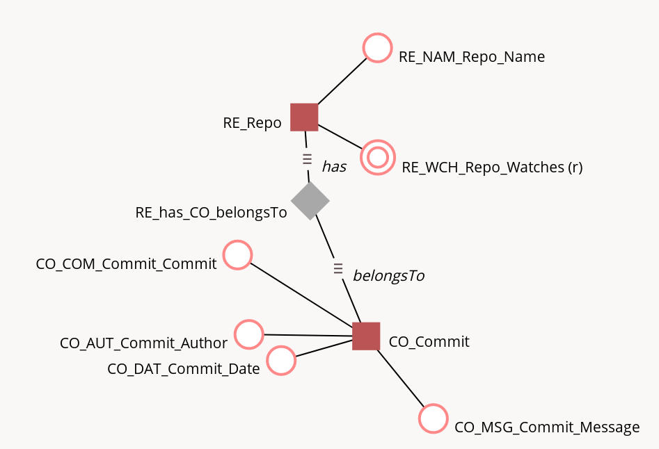

= Проектирование витрины в Google BigQuery

== ETL источник

Репозитории и коммиты

bigquery-public-data.github_repos.sample_repos
bigquery-public-data.github_repos.sample_commits

== Хранилище

Хранилище проектируем по идеологии anchor modeling

https://ois2.ttu.ee/uusois/!uus_ois2.ois_public.page_?_page=DF9175AB402E2383E097925418BCFB6818116956F635EC3A90AECEB2532C8A79&p_id=932F6DA320DA092A

=== Схема

=== Суррогатные ключи

Необходимы для якорной модели

https://cloud.google.com/dataprep/docs/html/Generate-Primary-Keys_57344595

https://cloud.google.com/bigquery/docs/reference/standard-sql/uuid_functions#generate_uuid

=== Create STAGE table

В случае с bigquery stage и ETL-источник - одно и то же. +
И они уже заполнены.

=== Скрипт для создания DWH

[source, sql]
----
include::./anchormodeling.com/create.sql[]
----

== Создаем представления для заполнения
