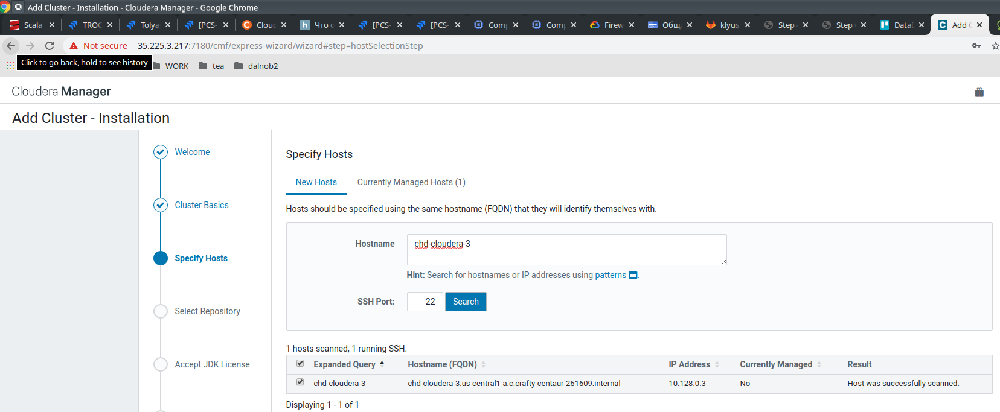
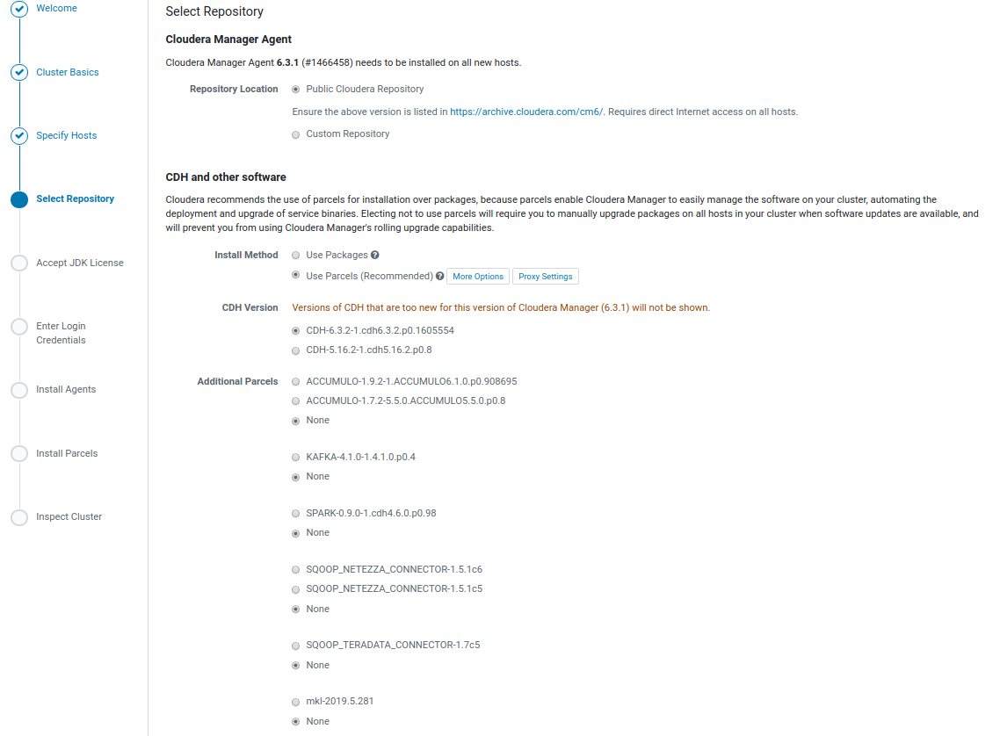
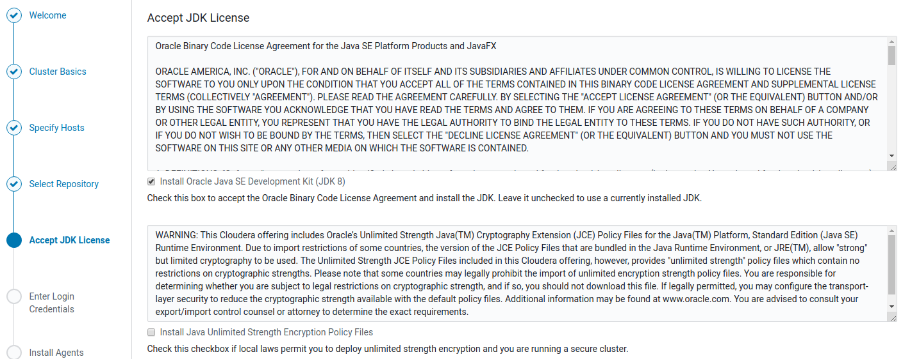
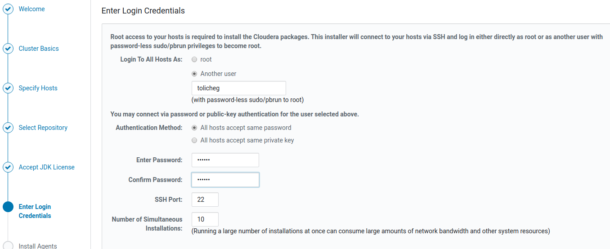
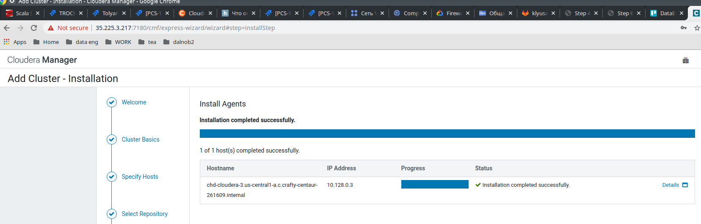
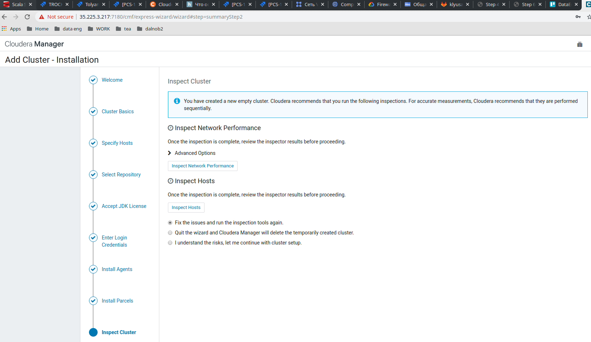

= Process for CentOS 7

== Pre

[source, bash]
----
create VM, 15G mem, 30G disk, 4 virt proc

sudo usermod -aG wheel user

# :)))
sudo yum install mc

sudo mcedit /etc/ssh/sshd_config
PasswordAuthentication yes
sudo systemctl restart sshd

sudo passwd user

#sudo firewall-cmd --set-default-zone=work
#sudo firewall-cmd --zone=work --add-service ssh
#sudo firewall-cmd --zone=work --add-service ssh --permanent

----

== Cloudera

https://docs.cloudera.com/documentation/enterprise/6/6.3/topics/install_cm_cdh.html

[source, bash]
----
sudo yum install wget
sudo wget https://archive.cloudera.com/cm6/6.3.1/redhat7/yum/cloudera-manager.repo -P /etc/yum.repos.d/
sudo rpm --import https://archive.cloudera.com/cm6/6.3.0/redhat7/yum/RPM-GPG-KEY-cloudera

#recommended 1.8
sudo yum install java-1.8.0-openjdk-devel

sudo yum install cloudera-manager-daemons cloudera-manager-agent cloudera-manager-server

#postgres12 (from of site)
sudo yum install https://download.postgresql.org/pub/repos/yum/reporpms/EL-7-x86_64/pgdg-redhat-repo-latest.noarch.rpm
sudo yum install postgresql12
sudo yum install postgresql12-server
sudo /usr/pgsql-12/bin/postgresql-12-setup initdb
sudo systemctl enable postgresql-12
sudo systemctl start postgresql-12

sudo passwd postgres

sudo yum install python-pip
sudo pip install --upgrade pip

#sudo under user does not help
su
echo 'LC_ALL="en_US.UTF-8"' >> /etc/locale.conf
exit

sudo mcedit /var/lib/pgsql/12/data/pg_hba.conf
- change local   all             all                                     peer
         to
         local   all             all                                     md5
- Add the following line:
  host all all 127.0.0.1/32 md5
  If the default pg_hba.conf file contains the following line:
  host all all 127.0.0.1/32 ident
  then the host line specifying md5 authentication shown above must be inserted before this ident line.

sudo mcedit /var/lib/pgsql/12/data/postgresql.conf
max_connection = 150
shared_buffers = 256MB
# wal_buffers now based on shared_buffers, so instruction tells us 8MB, but we leave -1

sudo usermod -aG postgres tolicheg

sudo systemctl restart postgresql-12

su postgres
psql
CREATE ROLE scm LOGIN PASSWORD 'scm';
CREATE DATABASE scm OWNER scm ENCODING 'UTF8';
CREATE ROLE amon LOGIN PASSWORD 'amon';
CREATE DATABASE amon OWNER amon ENCODING 'UTF8';
CREATE ROLE rman LOGIN PASSWORD 'rman';
CREATE DATABASE rman OWNER rman ENCODING 'UTF8';
CREATE ROLE hue LOGIN PASSWORD 'hue';
CREATE DATABASE hue OWNER hue ENCODING 'UTF8';
CREATE ROLE hive LOGIN PASSWORD 'hive';
CREATE DATABASE metastore OWNER hive ENCODING 'UTF8';
CREATE ROLE sentry LOGIN PASSWORD 'sentry';
CREATE DATABASE sentry OWNER sentry ENCODING 'UTF8';
CREATE ROLE nav LOGIN PASSWORD 'nav';
CREATE DATABASE nav OWNER nav ENCODING 'UTF8';
CREATE ROLE navms LOGIN PASSWORD 'navms';
CREATE DATABASE navms OWNER navms ENCODING 'UTF8';
CREATE ROLE oozie LOGIN PASSWORD 'oozie';
CREATE DATABASE oozie OWNER oozie ENCODING 'UTF8';
ALTER DATABASE oozie SET standard_conforming_strings=off;
exit from psql
exit from user postgres

sudo /opt/cloudera/cm/schema/scm_prepare_database.sh postgresql scm scm

sudo systemctl start cloudera-scm-server

sudo tail -f /var/log/cloudera-scm-server/cloudera-scm-server.log

sudo firewall-cmd --zone=work --add-source=85.238.106.134/32
sudo firewall-cmd --zone=work --add-port=7180/tcp
sudo firewall-cmd --zone=work --add-port=7182/tcp
sudo firewall-cmd --zone=work --add-port=80/tcp
sudo firewall-cmd --zone=work --add-port=8888/tcp
sudo firewall-cmd --runtime-to-permanent

# on the cdh-cloudera-3,4
sudo passwd tolicheg
#passwd the same as tolicheg
sudo passwd root
sudo mcedit /etc/ssh/sshd_config
PasswordAuthentication yes
sudo systemctl restart sshd
sudo mcedit /etc/sudoers
uncomment %wheel  ALL=(ALL)       NOPASSWD: ALL
sudo usermod -aG wheel user

# adding second node to firewall rules
sudo firewall-cmd --zone=work --add-source=10.128.0.3/32
sudo firewall-cmd --zone=work --add-source=10.128.0.3/32 --permanent
do the same for .4 address
# Also add to GCP firewall (VPC network firewall rules)

# for access to cdh-cloudera-3,4 claster node ()
ssh-keygen -t rsa
# 10.128.0.3,4 - cluster nodes
ssh-copy-id tolicheg@10.128.0.3
ssh-copy-id tolicheg@10.128.0.4

----

== Web-interface

=== Add node to cluster

NOTE: Created before, some actions upper in source )

As recommended after inspecting hosts on *chd-cloudera-3 and -4*

[source, bash]
----
su

mcedit /etc/sysctl.conf
vm.swappiness=10

mcedit /etc/systemd/system/disable-thp.service
[Unit]
Description=Disable Transparent Huge Pages (THP)

[Service]
Type=simple
ExecStart=/bin/sh -c "echo 'never' > /sys/kernel/mm/transparent_hugepage/enabled && echo 'never' > /sys/kernel/mm/transparent_hugepage/defrag"

[Install]
WantedBy=multi-user.target

systemctl daemon-reload
systemctl start disable-thp
systemctl enable disable-thp

reboot
----

After rebooting repeat step "Inspect cluster"

