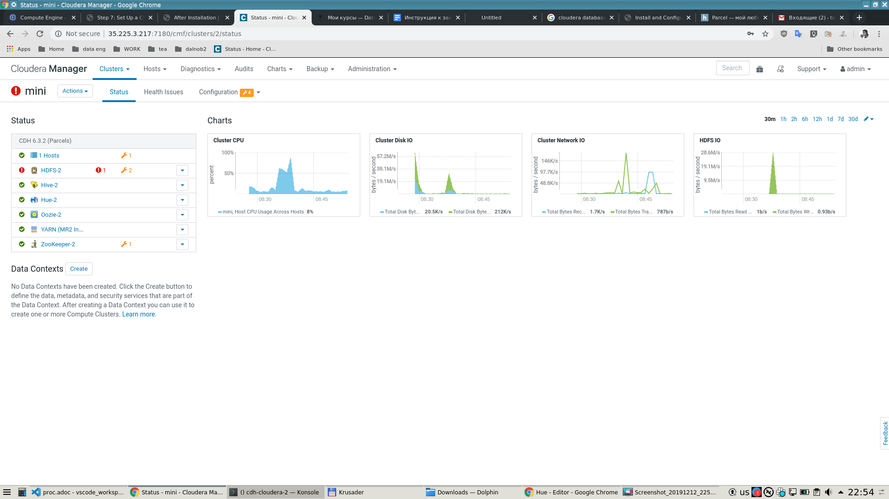
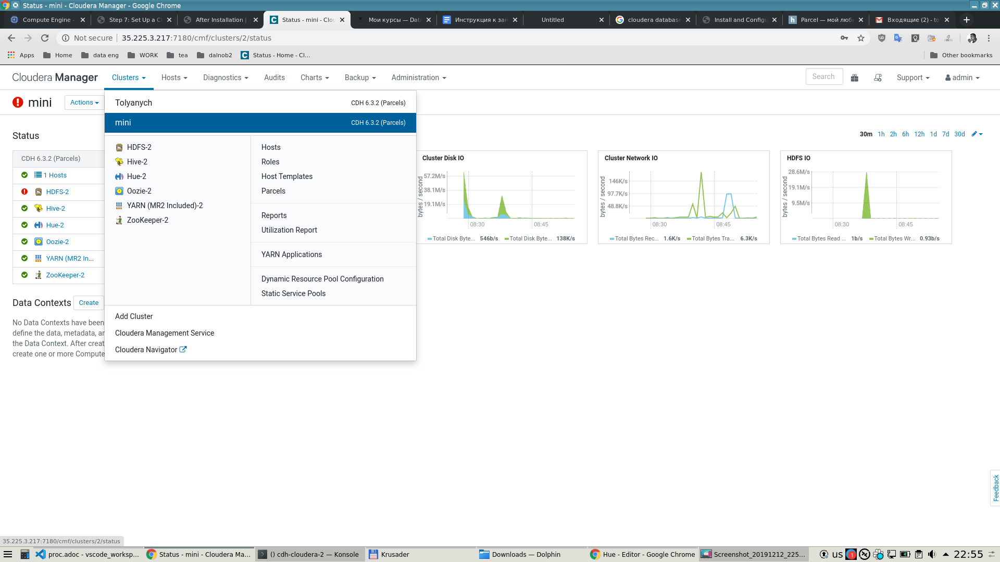
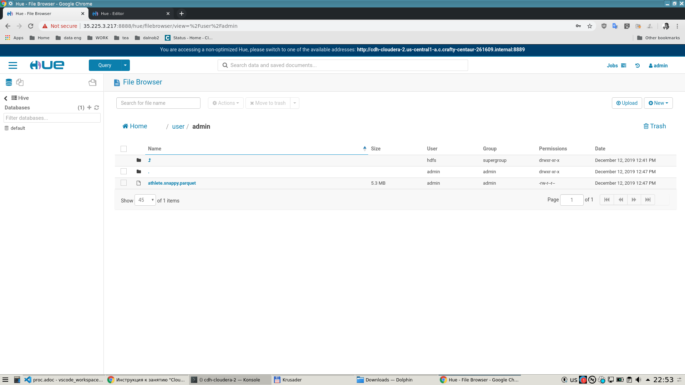
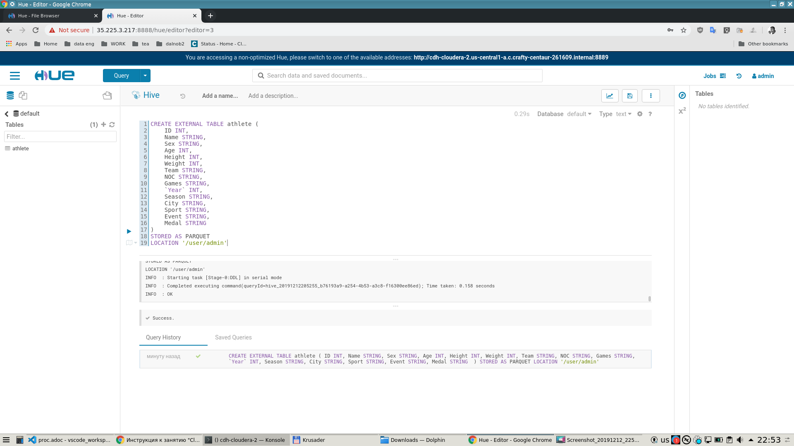
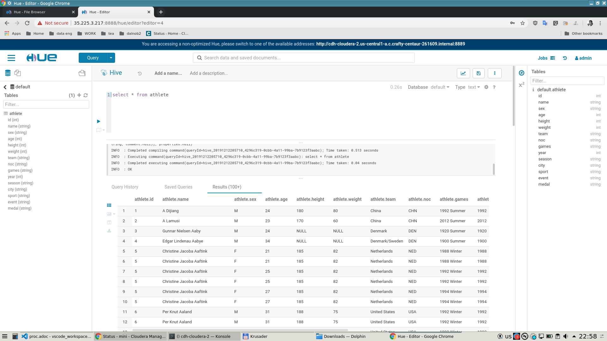

= ДЗ 3

== Описание

=== Глобальный план

* Развернуть кластер на центосе 7 (8 побоялся) с клаудерой последней версии 6.13 (тут не побоялся))

=== Попытка 1 (неудачная)

* Был план развернуть на трех машинах
  ** Машина1 - клаудера манагер + постгрес БД
  ** Машины 2, 3 - собственно кластер с HDFS, Hive, Hue, etc...

Не получилось, т.к. в гугле ограничения на ресурсы
(памяти, кажется, не больше 30, процессоров не больше 8, внешний IP в регионе только один).

С процессором и памятью я ужался, сделав  машины 2 и 3 с 2мя процессорами и по 7.5 гигов оперы

Но для веб-интерфейса hue, который в составе кластера находился на машине 2 или 3, нужен был стат. ip
в этом регионе, который уже был у клаудера-менеджера. +
Я не стал уже читтинговать и пробовать переносить машины 2,3 в другой регион или под другой аккаунт.

Думаю, чуть позже, когда прослушаю больше занятий, разверну это дело внутри компании, где сейчас работаю,
на реальных машинах внутри сети, так будет проще и надежнее.

=== Попытка 2

* Сделал кластер из одной машины, на этой же машине и клаудера менеджер и БД постгреса, в общем все.
* В реале это, конечно, утопичная система, но для тестов, думаю, подойдет :) +
  ----
  
  ----
  
  ----
* В hue не получилось создать папку именно по тому пути, по которому требовалось в задании, видимо, не было прав суперпользователя на HDFS. +
  Я уже не стал возиться и загрузил паркетный файл в папку по умолчанию. +
  Но если для выполнения задания на отлично это критично, я разберусь и создам там, где нужно. +
  ----
  
  ----
* В итоге файл загрузился и я создал внешнюю таблицу, которая на этот файл ссылается. +
  ----
  
  ----
* В качестве факультатива выполнил select (*) к таблице и посмотрел, кто там числится в списке атлетов :) +
  ----
  

=== Дополнительная попытка 3 (более сложные запросы)

[qanda]
Захотел выполнить аналитический запрос с участием first_value() partition by, order by...::
  Резульат - упал хью в кластере
Захотел выполнить простой select count(*)::
  Результат - упал хью в кластере :)

Подозреваю, что система не смогла добраться до конца датафайла, т.к. select count(*) - запрос с одной стороны простой, но, видимо, читает последовательно файл данных до конца.

=== Моя история команд, если придется потом повторить

link:proc_detail_commands.adoc[Команды]