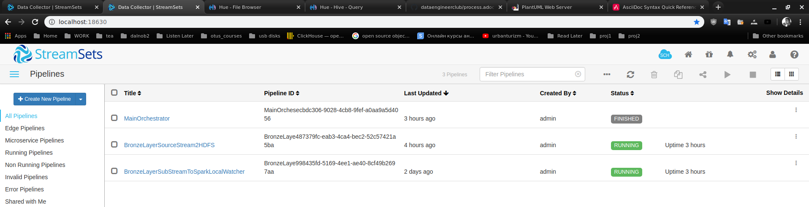
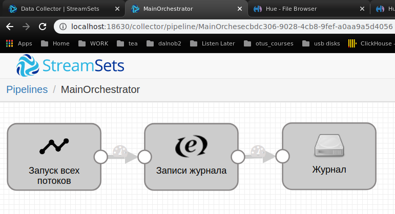
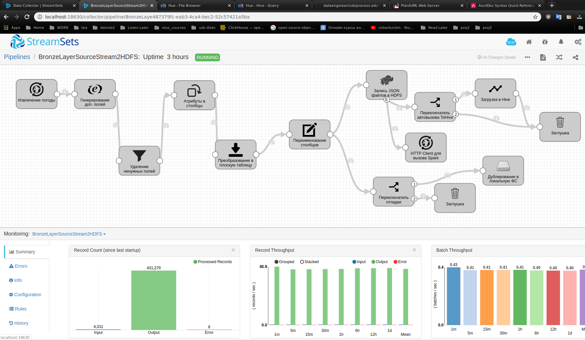
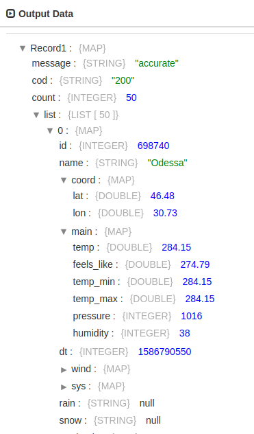
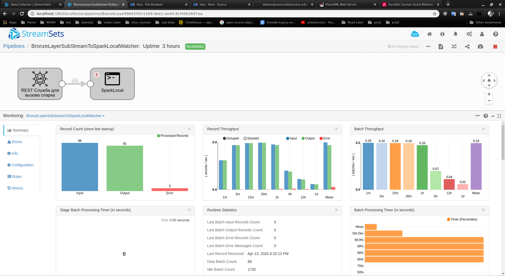
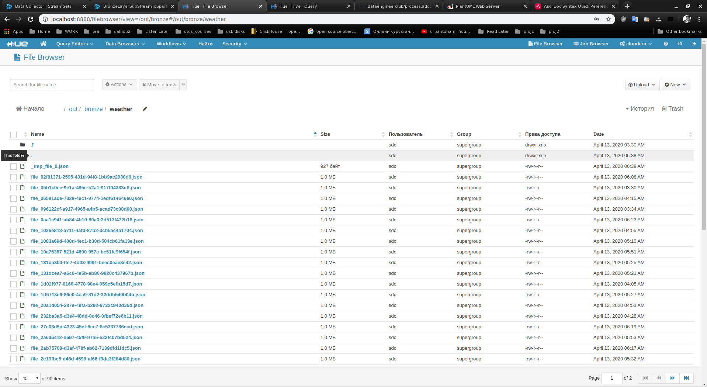
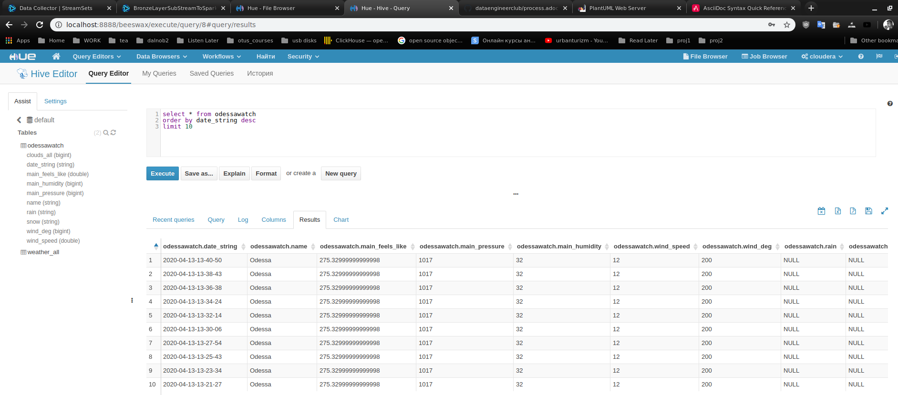
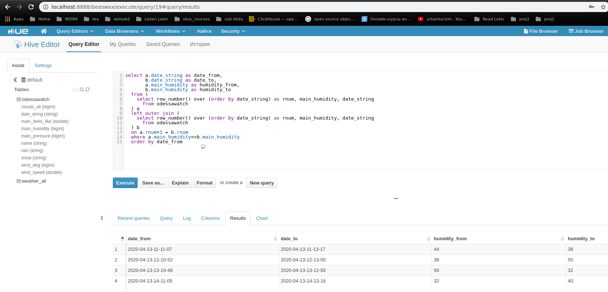
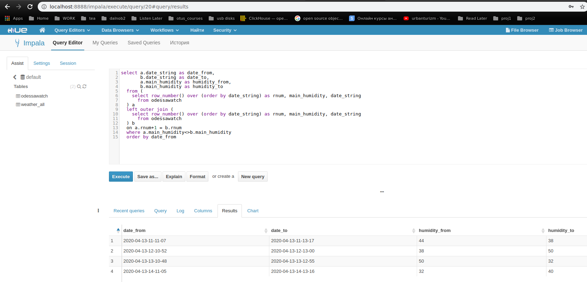

= Проект выпускника курсов OTUS Data engineering Клюсы А.Ю.

== Тема

Создание архитектуры по сбору, хранению и отслеживанию данных о погоде
из открытого источника http://openweathermap.org

== Постановка задачи

Я решил создать проект - основу для построения хранения и анализа
общедоступной информации.

Цель проекта - построить максимально недорогую открытую систему
для приема, хранения и анализа любой общедоступной информации
из открытых (а, возможно, и закрытых) источников.

Компоненты и решения, ввиду ограниченного срока разработки,
решено использовать классические и известные мне с курсов.
Более того, я использовал их docker-версии.

Система должна основываться на свободных, желательно open-source,
в крайнем случае недорогих, но эффективных и распространенных решениях.

Система должна быть способна к расширению
(добавление новых источников и приемников в хранилище под различные кейсы)
и масштабированию (компоненты системы могут объединяться в кластера)

При создании системы я старался придерживаться некоторых идеологий
DevOps, в частности, All As A Code, что потом очень хорошо ложится
в любую VCS вроде git, поэтому описание проекта, схема и документация
в asciidoc+plantuml.

=== Стоимость

Поскольку проект предназначен для использования в небольших
организациях или в личных целях, либо в каких-то небольших
научных исследованиях с малым бюджетом, я предполагал
применение только свободно распространяемых решений.

Таким образом, стоимость ПО для данного проекта нулевая.

=== Используемое программное обеспечение

* Streamsets (в учебном docker-контейнере)
* Cloudera CDH 5.7 (в учебном docker-контейнере)
* Spark 2.4.4
* Scala 2.11.12
* OS Linux Fedora 31 workstation

==== Вспомогательное ПО

* VS code
* Intelligent IDE Community edition with scala plugin
* Сборщик sbt
* PlantUML: построение UML диаграмм as a code
* Git + github
* Docker
* Oracle Virtualbox

=== Источник данных

Информация с сайта источника http://openweathermap.org
(при помощи rest api)

=== Хранилище

Типа Datalake

=== Витрины и бизнес-кейсы

Отслеживание погодных изменений по Одессе

=== Схема проекта

image::http://www.plantuml.com/plantuml/svg/ZLLTJpD55BwVNt42D-_xnbxe9Oa6b8Wc64Yuu498CtG7sdG_cfafY8QaBI8QZ0P2el42WuRxjdIX7wNyXJF_o3FJtQQu59XqTtFEdfbvdkVCFbrKcajT3NocogMmmYKFu8ieg4IX2FM6FlG5qCjF68q2POGi2ku9oJu5_0TZ768JyD7KS4H1tpImkG3u1pRnrjJCCTvZ7viVWJcXYYO-O4nN5sF0BjYOhW75zxG45RTiO4ufFGBiuCZKJOFIZpQ1FQ321_CZfMjsL_CJnLqcGYy1n7onHn7eg0A-sDKC0A_DoHYZhHk_9nf-LFLWRgqYmat1TL78RtW5tacXD2ojV_r-3hW25LLbGS3yQcclg3_tgm9-O4UCBHLq964EBomNyxDZqziAyMz2E32_uZqzsmIkWR6DtLBYErrL5k0kQIjeyaqYHjVn_GNZhP0cT8be4vQvvh3Aoy9DTJFodgzeLmB0W4OXRGueBGKFbD0AvjTBOHc-PP2CZSahbzhEJAL6bxEpR7PwWaTeThYoeA_nNpp7Iw263eZWCJKefXQVEPpUJg3oJbSXEG456aytB9RsHMO_E_0IsyJzZeJh0zwGC3riJogsdrcg55Iupz-ms9yuj9fQl6bLIkmfkQ-MlznmF8hUhafrJaVQjMjpPldQmzjnxNkmGQPDUSaFacEp8eK8fzJ8KjcHKVYzS2IoOyQEcThj9vcZvz5VOSkTkXQEJ2DTx5KkIlCzCM733ryaunqKPp79dFZdonxjX_yNLGsnvVesCCUlqPr4BAl0XFq5xTeW3EGWwOcbvWTSQfXVYNpFySgATcwzoNtfzHpsCSQUgSEQ9vJYcrmNYl3Er750-Ox535JRT2JmbgxEsBJQGDftx19KEvPuloGELDuBNbHJYaeaTVxZMP9U4Q5JMhQHo6QH3Z5EFTRyHblRauzt53ehnUx_qMIrVHrGP0rp5gXBP_gtOuiVfGZD6IoyVsiVq_RHWtvJ5lSXzo6nhGNBlePzIyErrVqPcDyPIrmxb_jioXod5w4toKV7c7icnSxutDt6pgsOlRc83ZPZTBD1uZvi_72Pz2YnwMHg-eiYzEZ_ypy0[]

== Реализация

=== Источник данных

* Проведена регистрация на сайте http://openweathermap.org
* Получен ключ для использования API в приложениях

=== Хранилище

В качестве хранилища данных использовал клаудеровские HDFS и Hive.
Остановился на этом, т.к. на большее не позволяло время, ресурсы
компьютера, да и проект декларируется как легкий и бюджетный.

Все это в предустановленном учебном контейнере quickstart.cloudera.

==== Бронзовый слой

Находится в HDFS в виде сырых json-файлов, поступивших от openweathermap.

Размер одного файла около 1МиБ (в учебных целях, в реальности больше).

Эти файлы не удаляются, в чем и есть предназначение бронзового слоя,
в любой момент из них можно повторно загрузить необходимую информацию.

==== Серебряный слой

Организован по принципу Ральфа Кимбалла.

Проект нацелен на бюджетность и его реализация была сильно ограничена во времени.
Поэтому я пришел к выводу, что нужно делать все максимально просто, эффективно и
для "здесь и сейчас".

Метод организации хранилища по принципу "что сейчас нужно для клиента, то и реализуем"
здесь, как мне кажется, подходит.

Для каждого бизнес-кейса в хранилище реализуется своя отдельная таблица и в спарковой,
джобе, которая перекачивает данные из необработанных в хранилище, для каждого
такого кейса предусмотрен отдельный блок кода и отдельный запрос.

===== Примечания

====== Что задумывалось

Задумывалась якорная модель хранилища и ее частичная реализация.

Мне вообще нравится якорная модель. Она мощная и гибкая.
Правда, громоздкая и сложно реализуемая.

Однако, из-за нехватки времени и декларирования проекта как
"быстро, бюджетно, здесь и сейчас" я остановился на принципе Кимбалла.

Кроме того, якорная модель мной уже подробно изучена в одном из ДЗ,
где я применил ее к google bigquery.

====== Локальный запуск спарка

Очень хотел запустить спарковую джобу на quickstart.cloudera на yarn, но
там старый спарк 1.6 и ява 1.7 (на них работает клаудеровский контейнер).

Если на спарк 1.6 я еще перевел, то установить яву 1.7 на свою ОС
мне не удалось по причине того, что нужно много чего даунгрейдить,
она как-то плохо уживается вместе с явой 1.8 и выше.

Потратил много времени, безуспешно пытаясь это все побороть.

В итоге решил запускать спарк локально в самом контейнере стримсета
(туда я пробросил каталог со спарком 2.4.4).

==== Золотой слой или витрины

Витрины у нас фактически лежат в серебряном слое, по методу Кимбалла,
это, конечно, сильно упрощенный вариант.

Поэтому витрины золотого слоя, datamart, которые видит непосредственно клиент,
по задумке этого проекта предполагают быть в виде представлений или просто
запросов к тем витринам, что лежат в хранилище данных.

=== Оркестрация

Оркестрация реализована при помощи Streamsets, который управляет

* Запуском основных потоков (пайплайнов)
* Вызывает раз в две секунды API источника для выкачки информации
* Событиями, которыа генерируются для вызова спарковой джобы (перекачка в сильвер-слой)
* Слушателем, который запускает по событиям выше спарковую джобу

=== Мониторинг

Функции мониторинга также может взять на себя Streamsets.

В процессе работы над проектом я запрограммировал его на запись различных
текстовых журналов, которые можно мониторить при помощи внешней системы типа того же ELK

Однако сам Streamsets очень хорошо и наглядно позволяет мониторить все этапы
по кр. мере бронзового слоя, начиная от обращения к источнику и заканчивая
укладкой данных в бронзовый слой и вызовом спарковой джобы для перекачки в сильвер.

На всех этих этапах видно, когда происходят ошибки и что-то ломается, видна
пропускная способность каждого этапа, количество переданных/принятых данных,
их перцентиль и прочее. +
Все это отлично визуализировано.

== Содержимое проекта

=== Streamsets

==== Пайплайны

 

===== Главный оркестратор

 

===== Загрузчик источника в бронзовый слой

 

====== Преобразование данных в бронзовом слое

Тут я немного схитрил и сохраняю не совсем сырые данные, а немного преобразованные.

Иными словами, чтобы мне было удобнее работать с одной таблицей и без составных типов данных,
я данные с сайта openweathermap "разворачиваю и уплощаю", использую компоненты
стримсета fields pivot и fields flattener.

Получаю я данные с сайта погоды такими:

image::1-4-2020-18-51-07-PM.png[] 

А пишу в слой сырых данных уже такими:

 

При этом любые внуутренние изменения в структуре данных отражаются и у меня,
то есть, преобразования практически без потерь.

Разве что если уж источник совсем коренным образом сменит формат данных,
тогда мой прием сломается, но это будет тогда другое приложение.

===== Оркестратор и прослушиватель для вызова спарковой джобы

 

=== Cloudera

==== Бронзовый слой в HDFS

 

==== Хранилище серебряного слоя, кейс OdessaWatch

 

==== Витрина золотого слоя по кейсу OdessaWatch

Для витрины можно выполнять запросы как в Hive, так и в Impala,
т.к. импале доступны метаданный хайва.

В этом прелесть экосистемы Hadoop, т.к для различных нужд
можно использовать различные движки, которые берут информацию с
одного и того же места: таблиц в HDFS.

Скажем, сложные и длительные запросы можно обрабатывать в
Hive на map reduce, а быстрые ad-hoc запросы или легкие
витринные запросы от клиентов на импале.

Ниже скрины с хайва и импалы.

Замечу, что запрос на импале выполнялся существенно меньше,
я так понимаю, из-за подготовительных операций и map reduce.

Зато, я думаю, импала плохо потянет запросы, обрабатывающие
и аггрегирующие много данных.

===== Запрос по изменению влажности по Одессе за все время

[source, sql]
----
select a.date_string as date_from,
       b.date_string as date_to,
       a.main_humidity as humidity_from,
       b.main_humidity as humidity_to
  from (
    select row_number() over (order by date_string) as rnum, main_humidity, date_string
      from odessawatch
  ) a
  left outer join (
    select row_number() over (order by date_string) as rnum, main_humidity, date_string
      from odessawatch
  ) b
  on a.rnum+1 = b.rnum
  where a.main_humidity<>b.main_humidity
  order by date_from
----

===== Скрины хайва и импалы

 

 

=== Spark

==== Job для загрузки в сильвер-слой.

[source, scala]
----
package org.kliusa.otusde201911.project.jsonprocessor

import java.text.SimpleDateFormat
import java.util.{Calendar, TimeZone}

import org.apache.log4j._
import org.apache.spark.sql.{SaveMode, SparkSession}

/*
* Модуль загружает из бронзового слоя в серебряный
* данные по каждому безнес-кейсу.
* Код, относящийся к каждому кейсу, помечен соотв. комментарием
*
* // CASE OdessaWatch - Кейс для отслеживания параметров погоды в Одессе.
* 
*/

object JsonProcessor extends App{

  val jsonName = args(0)
  val outPath = args(1)

  val currDateStr = new SimpleDateFormat("yyyy-MM-dd-HH-mm-ss").format(
    Calendar.getInstance( TimeZone.getTimeZone("Europe/Kiev") ).getTime()
  )

  // CASE OdessaWatch
  // Запрос для бизнес-кейса
  val sqlOdessaWatch =
    "select" +
    "    '"+currDateStr+"' as date_string, " +
    "    name," +
    "    main_feels_like," +
    "    main_pressure, main_humidity," +
    "    wind_speed, wind_deg," +
    "    rain, snow, clouds_all" +
    "  from json" +
    "  where id = 698740" +
    "  group by" +
    "    name," +
    "    main_feels_like," +
    "    main_pressure, main_humidity," +
    "    wind_speed, wind_deg," +
    "    rain, snow, clouds_all"

  BasicConfigurator.configure()

  Logger.getRootLogger
    .setLevel( Level.ERROR )

  val sparkSession = SparkSession.builder()
    .config("hive.metastore.uris", "thrift://quickstart.cloudera:9083")
    .enableHiveSupport()
    .getOrCreate()

  val jsonDf = sparkSession.read.format("json")
    .load(jsonName) // Датафрейм, в который загружаем исходный джейсон

  jsonDf.createOrReplaceTempView("json")  // Представление по датафрейму исходного джейсона для запросов

  // CASE OdessaWatch
  val dfOdessaWatch = sparkSession.sql(
    sqlOdessaWatch // Запрос по исходному джейсону для формирования целевого датасета
  ) // Целевой датафрейм для загрузки в БД

  // CASE OdessaWatch
  // Пишем целевой датасет в промежуточный авро (может использоваться в стримсетс)
  dfOdessaWatch.coalesce(1)
    .write.format("avro").mode(SaveMode.Append).save(outPath+"/OdessaWatch/"+currDateStr)

  // CASE OdessaWatch
  // Создаем представление для целевого датасета.
  // Из него потом запросом выгрузим в БД
  dfOdessaWatch.createOrReplaceTempView("viewOdessaWatch")  // на основе выборки

  // CASE OdessaWatch
  // Создаем таблицу в хайве, если ее вдруг нет
  val hiveCreateSql = sparkSession.sql("create table if not exists odessawatch as select * from viewOdessaWatch where 0=1")

  // CASE OdessaWatch
  // Заливаем туда данные
  val hiveInsertSql = sparkSession.sql("insert into odessawatch select * from viewOdessaWatch")

}
----

==== Скрипт сабмита джоба в спарк

[source, bash]
----
#!/bin/sh

# There was problems with --packages org.apache.spark:spark-avro_2.12:2.4.4 \
# So after a long time googling I found --packages org.apache.spark:spark-avro_2.11:2.4.3
# https://issues.apache.org/jira/browse/SPARK-27623

/spark/bin/spark-submit \
  --packages org.apache.spark:spark-avro_2.11:2.4.3 \
  --master local[*] \
  --class org.kliusa.otusde201911.project.jsonprocessor.JsonProcessor \
  /data/spark_local/jsonprocessor-assembly-1.jar \
  hdfs://quickstart.cloudera:8020$FILEPATH \
  hdfs://quickstart.cloudera:8020/out/bronze/weather2hive
----

== Примечания

=== Установка и разовая настройка

==== Клонируем репозиторий

Чтобы не грузить репозиторий гита, я смапил стейджы (библиотеки) streamsets в каталог `~/sdc-stagelibs`
(хотя, можно было включить в .gitignore, но уже поздно, сделал так, а проект сдавать :))

==== Каталоги

Необходим каталог `~/sdc-stagelibs`. +
Взять у меня или создать. Если создать, то ниже будет рассказано как его заполнить.

Необходим каталог `~/spark-2.4.4-bin-hadoop2.7` +
Скачать или взять у меня.

==== Права

Перейти в каталог гитового репозитория

[source, bash]
----
chmod 777 -R ~/sdc-stagelibs
chmod 777 -R project/sdc-data
chmod 777 -R project/sdc-stagelibs
chmod 777 -R project/shared_cloudera_quickstart
----

==== Запуск

`docker-compose up`

==== Разовая донастройка

Если до этого содержимое каталога `~/sdc-stagelibs` не было получено, то:

* Открыть в streamsets все пайплайны
* На какие стейджы стримсетс будет ругаться что отсутствует:
**  доустановить (меню пакетов в стримсетс), это разово, они потом сохраняться в
  `~/sdc-stagelibs`

==== Иоформация

Streamsets info

* location locahost: 18630
* credentials
** admin/admin

cloudera-quickstart info

* credentials
** claudera manager: admin/admin
** hue: claudera/claudera
* versions
** CDH 5.7.0
** Hadoop 2.6.0
** Hive 1.1.0

